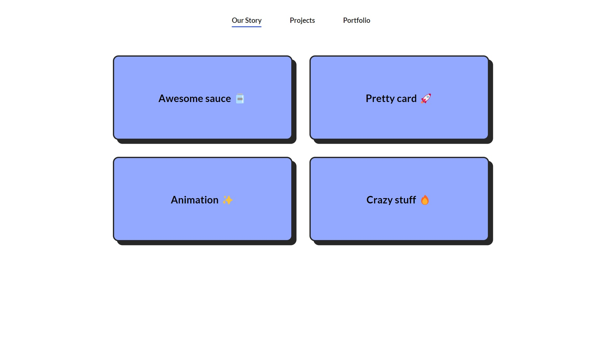

# Layout Animations using Javascript

This is a guide which shows how to perform layout animations using JS.

## Table of contents

- [Layout Animations using Javascript](#layout-animations-using-javascript)
  - [Table of contents](#table-of-contents)
  - [Overview](#overview)
    - [Screenshot](#screenshot)
    - [Links](#links)
  - [My process](#my-process)
    - [Built with](#built-with)

## Overview

### Screenshot

### Links

- [Live Demo](https://javascript-layout-animations.netlify.app/)

## My process

### Built with

- Semantic HTML5 markup
- CSS custom properties
- Flexbox
- CSS-Grid
- GSAP Js animation library
